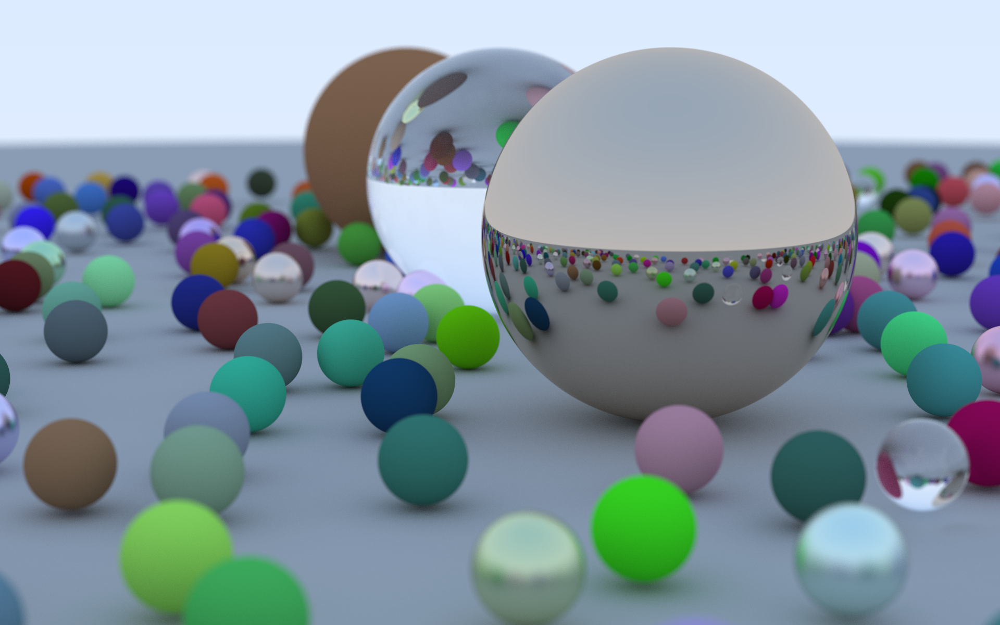

# RTIOW - Rust Version #



## So Far ##
- I first made a naive implementation of Ray Tracing In One Weekend by basically 1:1 copying the C++ into Rust
- I made changes to trade slower compilation for faster performance
    - link time optimization: fat
    - codegen units: 1
    - emit asm so llvm and further optimize
- I made various tweaks to make my code more idiomatic (hopefully), to satisfy my craving for functional programming, improve performance, and for aesthetic/dogma reasons 
    - Returning options instead of mutating C-like in/out parameters and returning a bool
    - Replacing imperative loops with map to express applying an operation on the whole collection simultaneously
    - Replacing if statements with match statements for FP reasons (much flimsier justification)
- I added the rayon crate 
    - Replaced .iter() and .into_iter() with .par_iter() and .into_par_iter()
    - tweaked rng generators and fold/reduce/collects until it compiled
    - Now with multithreaded execution, it was much faster

## Current Steps ##
- Figure out how to profile execution to find what are the slow parts
    - Possibly try timing runs with glam vs my own library to see which is faster
- Figure out how to pass threadsafe rng or statically give each thread its own rng rather than making a new rng for each thing
- Figure out what the best combination of parallel iterators are
    - Rows
    - Pixel in Row
    - Photon per Pixel
    - Which of these are better parallelized accounting for thread/rng overhead
- General idiomatic code/performance improvements

## Next Steps ##
- Ray Tracing: The Next Week
- Interactive Window
    - Move camera to find the best picture
    - Adjust camera effects like blur and fov
    - Redrawing the window takes less than 1s so low resolution and photon count
    - Load different scene
    - Fix Scene/Camera and Render high quality image to file
- Png output
- More shapes
    - Triangles, the vertex buffer default, allows for real polygons and general shapes
- More materials
- Possibly add distinction between vec3 and vec4 for homogeneous coordinates and normal vectors and such
- Allow loading of object files


## Benchmarking, Profiling, and Maximizing Performance ##

- Increasing Performance:
    - `--release` vs debug
    - `--emit=asm` vs none
    - `lto = fat` vs thin vs none
    - `codegen-units = 1`
    - `-C target-cpu=native`
    - `panic = abort`

- Using `perf` to profile
```bash
$ perf record --call-graph dwarf -- cargo run --release
$ perf report
```
- Build
```bash
RUSTFLAGS="--emit=asm -C target-cpu=native" cargo build --release 
```
- Run
```bash
time target/release/./raytracer_weekend > dump.ppm
```

